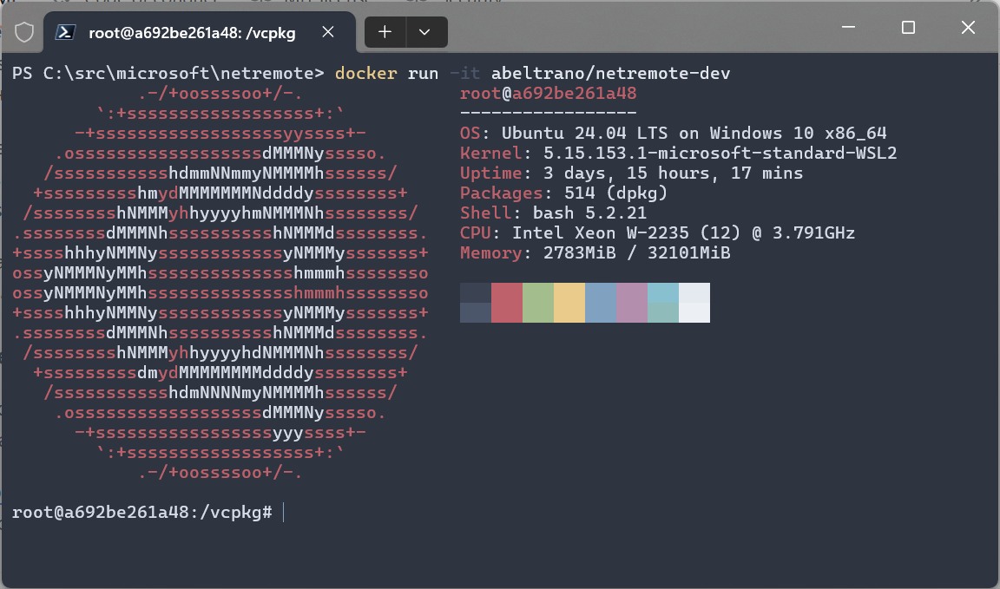

# Network Remote Control

[](https://github.com/microsoft/netremote/actions/workflows/cicd.yml)
[](https://github.com/microsoft/netremote/actions/workflows/build-linux.yml)
[](https://github.com/microsoft/netremote/actions/workflows/build-windows.yml)

This project provides the ability to remotely control network components such as Wi-Fi access points typically used to test network functionality on Windows.

## Project Structure

This project is organized to allow primary development on both Linux and Windows. Hence, [CMake](https://cmake.org/) is used as the build system generator. Consequently, there is an OS-independent source tree under [`src`](./src/common), and OS-dependent source trees [`linux`](./src/linux/) and [`windows`](./src/windows/).

## Coding Guidelines

Where possible, [C++ Standard Library](https://en.cppreference.com/w/cpp/header) primitives should be used for interoperability between common and OS-dependent code. The use of OS-specific primitives and libraries is reserved for scenarios where they are strictly needed (eg. calling an OS/System API), or where the highest possible performance is required and only the OS implementation can provide this.

The coding style is dictated by both `.clang-format` and `.clang-tidy` files at the root of the project. Please configure your editor to format and lint sources accordingly. Above all, ***the coding style should be kept as consistent as possible***. The exact style used is not overly important.

To help keep the code consistent, please follow these general guidelines:

* **DO** use spaces instead of tabs.
* **DON'T** prefix variable names to describe their type, scope, or visibility.
* **DO** use `std::filesystem` for storage and UNIX path separators (`/`) where possible.
* **DO** use `std::format` for string formatting.
* **DO** use complete words for variable and function names.
* **DO** use the following table for variable naming:

| Block | Style | Example |
| ----- | ----- | -------- |
| Types | PascalCase | `struct AccessPoint {};` |
| Functions | PascalCase | `AccessPoint GetAccessPointById(std::string_view id)` |
| Variables | camelCase | `AccessPoint accessPoint{};` |
| Parameters | camelCase | `void registerEventCallback(AccessPointEventCallback& eventCallback)` |
| Namespaces | lowercase | `namespace microsoft::net::remote` |
| Public Members | PascalCase | `struct AccessPoint { std::string Id; }` |
| Private Members | camelCase with `m_` prefix | `class AccessPoint { uint64_t m_sessionId; }` |

### Commit Signing

While not required, it is strongly recommended to configure git with a [GNU Privacy Guard (GPG)](https://gnupg.org/) signing key. This allows GitHub to verify commits were pushed by a specific user and will show a green `Verified` status beside each verified commit. Follow these steps to configure a signing key for commit verification:

1. Install the gpg tools for the target operating system (see the OS-specific `README` files for details: [Windows](./src/windows/README.md#2-configure-commit-signing-optional), [Linux](./src/linux/README.md#development-environment-setup)).
2. [Generate a gpg key](https://docs.github.com/en/authentication/managing-commit-signature-verification/generating-a-new-gpg-key)
3. [Add the gpg key to your github account](https://docs.github.com/en/authentication/managing-commit-signature-verification/adding-a-gpg-key-to-your-github-account)
4. [Configure git to use the gpg key](https://docs.github.com/en/authentication/managing-commit-signature-verification/telling-git-about-your-signing-key). This link will also tell you how to use gpg signing with an ssh key. Additionally, if you wish tell git to use a type any type of signing by default, be it gpg, ssh or X.509, you need to run the following command ```git config --global commit.gpgsign true```

## Development Environment Setup

Pre-requisities:

* C++ 20 Compiler
* CMake version >= 3.25

### Compiler

Both a compiler and standard C++ library supporting C++20 are required. The C++ reference pages for [C++20 core language features](https://en.cppreference.com/w/cpp/compiler_support#cpp20) and [C++20 library features](https://en.cppreference.com/w/cpp/compiler_support#C.2B.2B20_library_features) provide complete details about current compiler and library support.

#### Windows

[Visual Studio 2022](https://visualstudio.microsoft.com/thank-you-downloading-visual-studio/?sku=Enterprise&channel=Release&version=VS2022&source=VSLandingPage&cid=2030&passive=false) generally satisfies the requirements, however, the full integrated development environment (IDE) is not needed. A much leaner alternative for those using other editors such as Visual Studio Code can instead install [Visual Studio Build Tools](https://visualstudio.microsoft.com/downloads/#build-tools-for-visual-studio-2022). The build tools come with a C++ compatible compiler and standard library. Detailed development environment setup instructions can be found in the Windows [`README`](./src/windows/README.md).

#### Linux

g++ or llvm/clang are suitable, however, some care must be taken to obtain a compatible standard library. A known, working environment is ubuntu 23.10 (mantic) with clang 17.0.0 and LLVM 17.0.0. Both are both provided by the official ubuntu package repository so can be installed using `apt`. Detailed development environment setup instructions can be found in the Linux [`README`](./src/linux/README.md).

### CMake

CMake may be installed in any form, as long as the version meets the minimum. One popular way of installing it on Windows is to use [Chocolately](https://chocolatey.org/install) with `choco install -y cmake`. On Linux, all standard package managers provide a cmake package (eg. `apt-get install -y cmake`, `yum install -y cmake`, etc.).

To bootstrap the build environment, instruct CMake to generate the build files. It is strongly recommended to do this in a directory that is separate from the source; this allows one to easily destroy and recreate the build environment without affecting the checked-out source and changes in progress. Typically, a new directory called `build` at the top-level project tree is used for this purpose:

```Shell
git clone git@github.com:microsoft/netremote.git
cd netremote
cmake -DCMAKE_EXPORT_COMPILE_COMMANDS:BOOL=TRUE -Bbuild 
cmake --build build
```

#### CMake with Visual Studio Code

Alternatively, Microsoft provides a [CMake Tools](https://marketplace.visualstudio.com/items?itemName=ms-vscode.cmake-tools) Visual Studio Code extension that automates this process. After installing the extension and cloning the repository in VSCode, hit <kbd>Ctrl</kbd> + <kbd>Shift</kbd> + <kbd>P</kbd> or <kbd>F1</kbd>, then find the command **CMake: Delete Cache and Reconfigure**. This will generate the build configuration in a `build` folder at the top-level of the source tree. Once done, you can build the `ALL` target (default) with the **CMake: Build** command again (<kbd>Ctrl</kbd> + <kbd>Shift</kbd> + <kbd>P</kbd> or <kbd>F1</kbd>, type cmake, find the command).

In general, you set a build target and variant, then use the **CMake: Build** command to build incrementally. All build targets can be found in the **CMake: Project Outline** activity bar, but a list of them will also be shown when invoking actions that involve targets.

You may need to enable unsupported presets versions. To do this, press **File > Preferences** then search for 'presets' and enable the option **CMake: Allow Unsupported Presets Versions**.

### Docker-based Environment

A Docker image is available that provides a known working Linux development environment with all of the tools necessary pre-installed:

* [abeltrano/netremote-dev](https://hub.docker.com/r/abeltrano/netremote-dev): A container image for development of the project, including hostapd and building modules for the WSL2 kernel.

To use the Docker container image, [install Docker](https://docs.docker.com/get-docker/) on your development machine, then start an interactive instance, which will bring you to a bash shell:

```Shell
docker run -it abeltrano/netremote-dev
```



This provides the full development environment but does not sync source code. So instead of using the docker image directly, it is recommended to use a development container described in the [Dev Container](#dev-container) section below.

#### Dev Container

The docker images are also configured for use with [dev containers](https://containers.dev/). Many IDEs have built-in support for development containers, including but not limited to VSCode. This method is the easiest and fastest way to get a working development environment, especially if you're already using VSCode.

##### VSCode

Use of dev containers in VSCode is the recommended and officially supported development environment. To use this, [install Docker](https://docs.docker.com/get-docker/) on your development machine and install the [Dev Containers VSCode extension](https://marketplace.visualstudio.com/items?itemName=ms-vscode-remote.remote-containers). The Dev Containers extension has two (2) primary ways to use it:

1. **[Recommended]** Cloning directly into a named volume in the container.

    Clone the repository with the dev containers command to use a named volume: press <kbd>Ctrl</kbd> + <kbd>Shift</kbd> + <kbd>P</kbd> or <kbd>F1</kbd> and select the **Dev Containers: Clone Repository in Named Container Volume** dev container extension command. A named volume is a persistent filesystem that is mounted in the container and used to store the repository source code. This allows the source code to survive across container stops, removals, and deletions. As part of the command, you will be prompted to select the named volume to use. On first run, no volumes will have been created so select **Create a new volume** and give it any name you want (eg `source`). In subsequent command invocations to clone the repository, the source volume will exist and you can select it from the list.

    

2. Cloning locally and sharing source workspace with the container.

    Clone the repository as normal. With this method, VSCode will detect a dev container specification and prompt you to open it in a container:

    

    Alternatively, you can open the project in the container at any time by invoking the **Dev Containers: Open Folder in Container** dev container extension. Press <kbd>Ctrl</kbd> + <kbd>Shift</kbd> + <kbd>P</kbd> or <kbd>F1</kbd> and select **Reopen in Container**.

    A prompt will ask to select a `devcontainer.json` file:

    

    Select **NetRemoteDev-Stateless**, which is configured to mount the workspace directory in a bind mount instead of a volume. The **NetRemoteDev** configuration will not work.

> [!WARNING]
> A major drawback of this method is that the source tree is mounted in the container using a bind mount, which has extremely poor performance to the point where git operations are essentially unusable. Hence, this method typically requires two (2) VSCode windows: one for the repository on the host where git operations are carried out, and one for the container where the source is modified and built. Therefore, this method is strongly discouraged.

## Contributing

This project welcomes contributions and suggestions. Most contributions require you to agree to a
Contributor License Agreement (CLA) declaring that you have the right to, and actually do, grant us
the rights to use your contribution. For details, visit https://cla.opensource.microsoft.com.

When you submit a pull request, a CLA bot will automatically determine whether you need to provide a CLA and decorate the PR appropriately (e.g., status check, comment). Simply follow the instructions provided by the bot. You will only need to do this once across all repos using our CLA.

This project has adopted the [Microsoft Open Source Code of Conduct](https://opensource.microsoft.com/codeofconduct/). For more information see the [Code of Conduct FAQ](https://opensource.microsoft.com/codeofconduct/faq/) or contact [opencode@microsoft.com](mailto:opencode@microsoft.com) with any additional questions or comments.

## Trademarks

This project may contain trademarks or logos for projects, products, or services. Authorized use of Microsoft trademarks or logos is subject to and must follow [Microsoft's Trademark & Brand Guidelines](https://www.microsoft.com/en-us/legal/intellectualproperty/trademarks/usage/general).  Use of Microsoft trademarks or logos in modified versions of this project must not cause confusion or imply Microsoft sponsorship. Any use of third-party trademarks or logos are subject to those third-party's policies.
